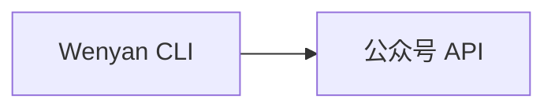
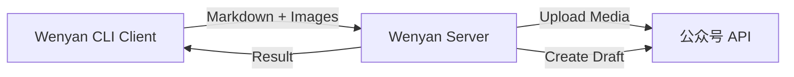

<div align="center">
    
</div>

# 文颜 CLI

[](https://www.npmjs.com/package/@wenyan-md/cli)
[](LICENSE)

[](https://hub.docker.com/r/caol64/wenyan-cli)
[](https://github.com/caol64/wenyan-cli)

## 简介

**[文颜（Wenyan）](https://wenyan.yuzhi.tech)** 是一款多平台 Markdown 排版与发布工具，支持将 Markdown 一键转换并发布至：

-   微信公众号
-   知乎
-   今日头条
-   以及其它内容平台（持续扩展中）

文颜的目标是：**让写作者专注内容，而不是排版和平台适配**。

## 文颜的不同版本

文颜目前提供多种形态，覆盖不同使用场景：

-   [macOS App Store 版](https://github.com/caol64/wenyan) - MAC 桌面应用
-   [跨平台桌面版](https://github.com/caol64/wenyan-pc) - Windows/Linux
-   👉[CLI 版本](https://github.com/caol64/wenyan-cli) - 本项目
-   [MCP 版本](https://github.com/caol64/wenyan-mcp) - AI 自动发文
-   [UI 库](https://github.com/caol64/wenyan-ui) - 桌面应用和 Web App 共用的 UI 层封装
-   [核心库](https://github.com/caol64/wenyan-core) - 嵌入 Node / Web 项目

## 特性

- 一键发布 Markdown 到微信公众号草稿箱
- 自动上传本地图片与封面
- 支持远程 Server 发布（绕过 IP 白名单限制）
- 内置多套精美排版主题
- 支持自定义主题
- 支持 Docker 和 npm
- 可作为 CI/CD 自动发文工具
- 可集成 AI Agent 自动发布

## 本地模式和远程客户端模式

文颜 CLI 支持两种运行模式：**本地模式（Local Mode）** 和 **远程客户端模式（Client–Server Mode）**。两种模式运行效果完全一致，你可以根据运行环境和网络条件选择最合适的方式。

### 本地模式（Local Mode）

在本地模式下，CLI 直接调用微信公众号 API 完成图片上传和草稿发布。



**优点：**

* 无需额外服务器
* 架构简单，部署成本低
* 适合个人开发者和本地使用

**限制：**

> ⚠️ 微信公众号 API 要求调用方 IP 必须在白名单内。如果没有固定 IP，需要频繁添加白名单。

### 远程客户端模式（Client–Server Mode）

在此模式下，CLI 作为客户端，将发布请求发送到部署在云服务器上的 Wenyan Server，由 Server 完成微信公众号 API 调用。



**优点：**

* 无需本地固定 IP
* 完美绕过微信 IP 白名单限制
* 支持动态 IP 环境
* 支持团队协作
* 支持 CI/CD 自动发布
* 支持 AI Agent 自动发布

### Server 模式部署

[文档](docs/server.md)。

## 安装说明

### npm 安装（推荐）

```bash
npm install -g @wenyan-md/cli
```

运行：

```bash
wenyan --help
```

### docker 安装

[文档](docs/docker.md)。

## 命令概览

```bash
wenyan <command> [options]
```

| 命令      | 说明        |
| ------- | --------- |
| [publish](docs/publish.md) | 发布文章      |
| render  | 渲染 HTML   |
| [theme](docs/theme.md)   | 管理主题      |
| [serve](docs/server.md)   | 启动 Server |

## 关于图片与封面自动上传

无论是本地模式还是远程客户端模式，文颜 CLI 都提供**极度智能**的图片处理机制：

- 识别并支持本地硬盘绝对路径（如：`/Users/xxx/image.jpg`）
- 识别并支持当前目录的相对路径（如：`./assets/image.png`）
- 识别并支持网络路径（如：`https://example.com/image.jpg`）

## 环境变量配置

在实际向微信公众号发文的环境（你的本地或部署 `serve` 的服务器）中，必须配置以下环境变量：

-   `WECHAT_APP_ID`
-   `WECHAT_APP_SECRET`

## 微信公众号 IP 白名单

> [!IMPORTANT]
>
> 请确保运行文颜的机器 IP 已加入微信公众号后台的 IP 白名单，否则上传接口将调用失败。

配置说明文档：[https://yuzhi.tech/docs/wenyan/upload](https://yuzhi.tech/docs/wenyan/upload)

## Markdown Frontmatter 说明（必读）

为了正确上传文章，每篇 Markdown 顶部需要包含 frontmatter：

```md
---
title: 在本地跑一个大语言模型(2) - 给模型提供外部知识库
cover: /Users/xxx/image.jpg
author: xxx
source_url: http://
---
```

字段说明：

-   `title` 文章标题（必填）
-   `cover` 文章封面
    -   本地路径或网络图片
    -   如果正文中已有图片，可省略
-   `author` 文章作者
-   `source_url` 原文地址

## 示例文章格式

```md
---
title: 在本地跑一个大语言模型(2) - 给模型提供外部知识库
cover: /Users/lei/Downloads/result_image.jpg
---

在[上一篇文章](https://babyno.top/posts/2024/02/running-a-large-language-model-locally/)中，我们展示了如何在本地运行大型语言模型。本篇将介绍如何让模型从外部知识库中检索定制数据，提升答题准确率，让它看起来更“智能”。

## 准备模型

访问 `Ollama` 的模型页面，搜索 `qwen`，我们使用支持中文语义的“[通义千问](https://ollama.com/library/qwen:7b)”模型进行实验。


```

## 赞助

如果你觉得文颜对你有帮助，可以给我家猫咪买点罐头 ❤️

[https://yuzhi.tech/sponsor](https://yuzhi.tech/sponsor)

## License

Apache License Version 2.0
